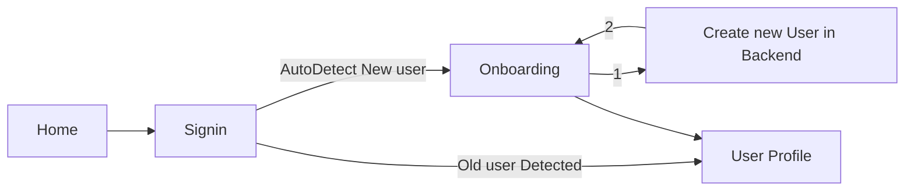

# Luganodes Task

This is the (broken) submission for the LugaNodes SDE Development Task 4. The Task was to allow for a seamless authentication process for the user, and to allow for the user to be able to view their profile information. The authentication should support Web3 Authentication using MetaMask Wallet as well as Username Password.

## Features

- Seamless sign-in

## Tech Stack

- MongoDB
- Mongoose
- ExpressJS
- ReactJS
- Moralis
- PassportJS

## Installation

### Getting API Keys

For Web3 Authentication, we use Moralis. We need to get a Moralis API Key and add it to the `.env` file first. The `.env` file can be created from the `.env.example` file. The Moralis API Key can be obtained from [Moralis](https://moralis.io/)


### Running the Frontend

**DO NOTE** that the frontend runs on port 3001 and not 3000.

To run the frontend, just run the following commands:

```bash
cd frontend
npm i
npm start
```

### Running the Backend

The backend can be run using the following command:

```bash
cd backend/javascript
npm i -g nodemon
npm i
nodemon index.js
```

## Endpoints

### Frontend

1. `/` -> the Home component (unauthenticated)
2. `/signin` -> The signin component (unauthenticated)
3. `/onboarding` -> The onboarding component (authenticated)
4. `/user` -> The user component (authenticated)
   
The flow works like this:



### Backend
Endpoints:

- `/request-message` (POST): Receives a request message containing address, chain, and network and returns a message that the client needs to sign to confirm their identity using Moralis Auth.

- `/verify` (POST): Verifies the signed message received from the client; if it's a wallet login, it checks the user's wallet address against the database, creates a JWT token, and returns the user data and login status. If it's a username-password login (currently not implemented), it will perform the appropriate actions.

- `/authenticate` (GET): Verifies the JWT token sent in the request cookie and returns the user data if the token is valid; otherwise, returns a 403 (Forbidden) status code.

- `/signup` (POST): Receives user data from the client and creates a new user in the database using the createUser function.

- `/logout` (GET): Clears the JWT token cookie, effectively logging out the user, and returns a 200 (OK) status code.